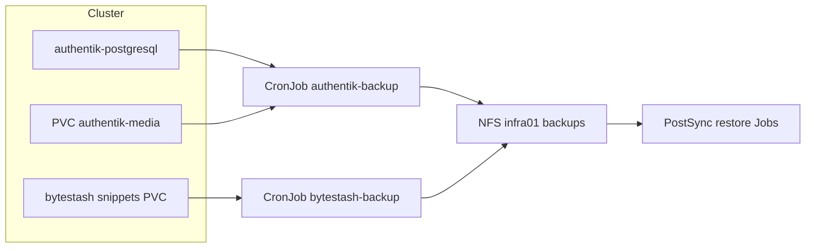

# ADR-0015: App-Backups per CronJob auf NFS

- **Status:** Accepted
- **Datum:** 2026-09-11 (ergänzt 2026-09-27)
- **Kontext:** status, vaultwarden, termix, bookstack, authentik, bytestash, n8n

## Kontext

Longhorn-Volume-Backups decken nicht alle App-Semantiken ab (SQLite-Dateien, `pg_dump`, konsistente App-Daten). Cluster-Neuaufsetzen braucht einen einfachen Restore-Pfad ohne externe Backup-Suite.

## Entscheidung

- Tägliche **CronJobs** sichern App-Daten auf NFS `192.168.0.25:/var/nfs/shared/infra01/<app>-backups` (Retention typisch 7).
- Muster: oft `kubectl exec` + `tar` bzw. `pg_dump` in Job-Pods.
- **Bootstrap-Restore** über ConfigMap (`*-restore`: `enabled` / optional `force`) und PostSync-Job; nach erfolgreichem Restore sofort `enabled=false` committen.
- Secrets weiterhin über SecretSpecs wiederherstellen (gleiche Crypto-Keys wo nötig, z. B. Termix).

### Zeitplan (UTC)

| App | Cron | Inhalt |
|-----|------|--------|
| status (Uptime Kuma) | 01:00 | tar data |
| vaultwarden | 02:00 | tar `/data` |
| termix | 03:00 | `pg_dump` |
| bookstack | 04:00 | MariaDB + `/config` |
| **authentik** | **05:00** | `pg_dump` + `/media` |
| **bytestash** | **06:00** | tar `/data/snippets` |
| **n8n** | **03:30** | `pg_dump` + tar `.n8n` |

Diagramme: [`docs/diagrams/archify/app-nfs-backup.html`](../diagrams/archify/app-nfs-backup.html), [`app-bootstrap-restore.html`](../diagrams/archify/app-bootstrap-restore.html).

Details in den App-READMEs / Root-README / BookStack `minilab/05-backup-restore`.

## Konsequenzen

- NAS-Ordner müssen existieren; NFSv3-Kompatibilität beachten.
- Restore ist bewusst manuell getoggelt (kein stilles Überschreiben).
- Authentik: Branding-Media-Sync (NFS → `/media/public/branding`) bleibt separat; Backup deckt zusätzlich Uploads/Icons auf der Media-PVC ab. Secrets nicht im Archive.
- Ergänzt, ersetzt aber nicht Longhorn-Backup-Target ([ADR-0009](0009-longhorn-nfs-backups.md)).
