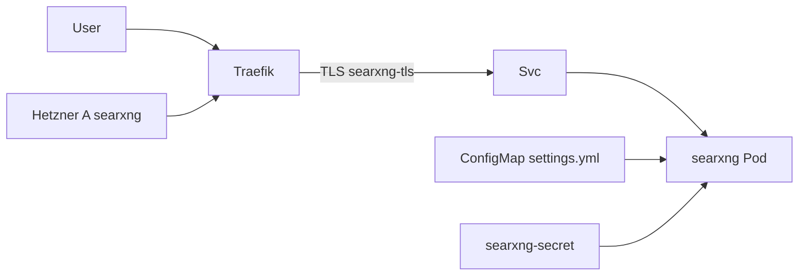

# ADR-0018: SearXNG als LAN-Metasearch

- **Status:** Accepted
- **Datum:** 2026-09-27
- **Kontext:** `apps/searxng/`, Issue [HenryHST/minilab#65](https://github.com/HenryHST/minilab/issues/65)

## Kontext

Homelab braucht eine datenschutzfreundliche Metasuche ohne Public Exposure und ohne SSO-Zwang (Utility wie IT-Tools).

## Entscheidung

- **Ownership:** GitOps in minilab (`apps/searxng` + Argo Application Wave 3).
- **Host:** `searxng.stadthagen.dev` → Traefik LB `192.168.0.215` (LAN-only; kein Pangolin-Publish).
- **Auth:** nur Traefik TLS (kein Authentik/ForwardAuth).
- **Runtime:** ein Container, Image-Pin (kein `latest`); kein Valkey/Bot-Limiter in v1 (optional später).
- **Secret:** `SEARXNG_SECRET` via Infra_LAB SecretSpec → K8s `searxng/searxng-secret` (nicht in Git).

## Konsequenzen

- DNS A-Record manuell (Hetzner Console), nicht in TF `dns_records` / pangolin-publish.
- Upstream-Egress zu Suchmaschinen nötig (NetworkPolicy nur Ingress einschränken).
- Valkey/Limiter und Public Exposure bleiben Out-of-Scope bis neues ADR.
