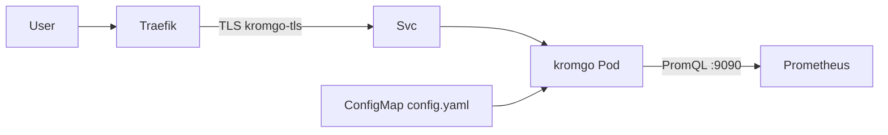

# ADR-0019: Kromgo als LAN-Badge-Proxy

- **Status:** Accepted
- **Datum:** 2026-09-27
- **Kontext:** `apps/kromgo/`, Issue [HenryHST/minilab#67](https://github.com/HenryHST/minilab/issues/67)

## Kontext

Prometheus-Metriken sollen als SVG-Badges (README/Docs) nutzbar sein, ohne die Prometheus-UI freizugeben.

## Entscheidung

- **Ownership:** GitOps in minilab (`apps/kromgo` + Argo Application Wave 3).
- **Deploy-Form:** Plain YAML (kein OCI-Helm / kein `helm-manifest.yaml`) — Traefik IngressRoute + NetPol wie andere User-Apps ([ADR-0014](0014-helm-strategie.md)).
- **Host:** `kromgo.stadthagen.dev` → Traefik LB `192.168.0.215` (LAN-only; kein Pangolin).
- **Backend:** `KROMGO_PROMETHEUS_URL` → `kube-prometheus-stack-prometheus.monitoring.svc:9090`.
- **NetPol:** Prometheus erlaubt Ingress aus NS `kromgo` auf :9090; Kromgo-Egress nur monitoring:9090 + DNS.
- **Image-Pin:** `ghcr.io/home-operations/kromgo:0.16.1`.

## Konsequenzen

- Badge-Definitionen leben in der ConfigMap (GitOps); neue Endpoints = Config-Commit.
- Public Exposure bleibt Out-of-Scope bis neues ADR / pangolin-publish.
