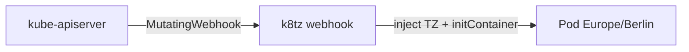

# ADR-0020: k8tz für Cluster-Timezone Europe/Berlin

- **Status:** Accepted
- **Datum:** 2026-09-27
- **Kontext:** `infra/k8tz/`, Issue [HenryHST/minilab#68](https://github.com/HenryHST/minilab/issues/68)

## Kontext

Container erben keine Node-Timezone und nutzen typischerweise UTC. Logs und App-Zeiten sollen im Homelab einheitlich `Europe/Berlin` sein, ohne tzdata in jedem Image.

## Entscheidung

- **Ownership:** GitOps via ApplicationSet `infra` + native Argo Helm ([ADR-0014](0014-helm-strategie.md)).
- **Chart:** `k8tz` 0.20.0 (`https://k8tz.github.io/k8tz/`), Namespace `k8tz`, sync wave `1`.
- **Default-TZ:** `Europe/Berlin`; Strategie `initContainer`; `injectAll: true`.
- **Webhook:** Chart-TLS (`certManager.enabled: false`); `failurePolicy: Ignore`; ignore `kube-system` + `k8tz`.
- **Opt-out / Override:** Annotations `k8tz.io/inject`, `k8tz.io/timezone`, `k8tz.io/strategy`.

## Konsequenzen

- Neue Pods (außer ignored NS / Opt-out) bekommen einen k8tz-InitContainer und lokale Zeit.
- Webhook-Ausfall blockiert keine Creates (`Ignore`); fehlende Injection möglich bis Webhook wieder healthy.
- Kein Ingress/Homepage — reiner Cluster-Controller.
