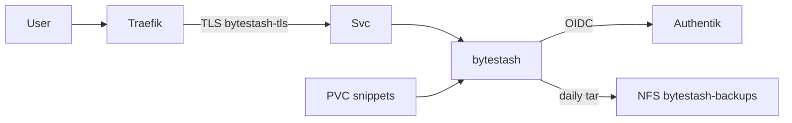

# ADR-0021: ByteStash mit Authentik-OIDC

- **Status:** Accepted
- **Datum:** 2026-09-27
- **Kontext:** `apps/dev/bytestash/`, Issue [HenryHST/minilab#69](https://github.com/HenryHST/minilab/issues/69)

## Kontext

Homelab braucht einen selbstgehosteten Snippet-Store mit SSO; ByteStash bietet native OIDC und SQLite unter `/data/snippets`.

## Entscheidung

- **Ownership:** GitOps Wave 3 plain Application (`apps/dev/bytestash`), nicht ApplicationSet.
- **Host:** `bytestash.stadthagen.dev` → Traefik LB `192.168.0.215` (LAN-only).
- **Auth:** native OIDC gegen Authentik (Redirect `/api/auth/oidc/callback`); keine ForwardAuth.
- **Secrets:** `BYTESTASH_OAUTH_CLIENT_SECRET` + `BYTESTASH_JWT_SECRET` via SecretSpec (nicht in Git).
- **Storage:** PVC Longhorn → `/data/snippets`; Image-Pin `ghcr.io/jordan-dalby/bytestash:1.5.12`.
- **Backup:** CronJob `bytestash-backup-cron` (06:00 UTC) tar’t `/data/snippets` → NFS `…/bytestash-backups` (Retention 7). Bootstrap-Restore via ConfigMap `bytestash-restore` (`enabled`/`force`) — siehe [ADR-0015](0015-backup-restore-cronjobs.md).

## Konsequenzen

- Terraform `bytestash_oauth` + SecretSpec müssen denselben Client-Secret teilen.
- Interne Accounts deaktiviert (`DISABLE_INTERNAL_ACCOUNTS`); Admin via `ADMIN_USERNAMES`.
- Restore nur bewusst mit `enabled=true` (bei vorhandenen Snippets zusätzlich `force=true`); danach sofort `enabled=false` committen.
