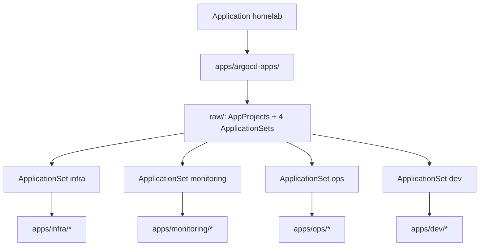

# ADR-0022: Apps-Buckets und vier ApplicationSets

- **Status:** Accepted
- **Datum:** 2026-09-27
- **Kontext:** Issue [#72](https://github.com/HenryHST/minilab/issues/72); ersetzt/erweitert [ADR-0004](0004-applicationset-infra.md) und [ADR-0006](0006-appproject-infrastruktur.md)
- **Supersedes:** ADR-0004 (einzelnes ApplicationSet `infra` + flaches `infra/` / `apps/`), ADR-0006 (monolithisches AppProject `infrastruktur`)

## Kontext

Workloads lagen flach unter `infra/*` und `apps/<name>/`, verdrahtet über ein ApplicationSet `infra` plus viele Einzel-Application-YAMLs. Das erschwerte Ownership, Sync-Wave-Übersicht und AppProject-Trennung (Monitoring vs. Ops vs. User-Apps).

## Entscheidung

### Git-Layout

Vier Buckets unter `apps/`:

| Bucket | Inhalt (Beispiele) |
|--------|-------------------|
| `apps/infra/` | longhorn, k8tz |
| `apps/monitoring/` | metrics-server, kube-prometheus-stack, loki, alloy, status, unpoller, kromgo |
| `apps/ops/` | cert-manager, registry, newt, authentik, headlamp, hubble-ui, pangolin-publish, … |
| `apps/dev/` | bookstack, termix, vaultwarden, searxng, bytestash, … |

Root-`infra/` entfällt. Stubs (`kargo`, `audiobookshelf`) liegen im Bucket, sind aber **nicht** in ApplicationSet-Listen, bis deployfertig.

### Argo-Wiring

- Parent `homelab` synct nur `apps/argocd-apps/` (Bootstrap-Application + `raw/`).
- Bootstrap-Application **`gitops-bootstrap`** (früher `infra-applicationset`) synct `apps/argocd-apps/raw/`.
- Vier AppProjects (`infra`, `monitoring`, `ops`, `dev`) mit Destination-Namespace-Allowlists.
- Vier ApplicationSets mit derselben List-/goTemplate-/`templatePatch`-Mechanik wie zuvor (ADR-0004-Technik bleibt gültig).
- Application-**Namen** unverändert (`unifipoller`, `grafana-loki`, …) — nur Git-`path` / `helmValuesFile` ändern → Adoption ohne Workload-Recreate.
- Sync Waves bleiben in Listeneinträgen (cert-manager `0`, longhorn/k8tz/`kube-prometheus-stack` `1`, User-Apps `2`–`3`).

Helm-Strategie unverändert ([ADR-0014](0014-helm-strategie.md)).

## Migration (orphan-safe)

Reihenfolge laut ADR-0004-Warnung (Finalizer-Konflikte). **Parent `homelab` Autosync/Prune vor dem Merge pausieren**, sonst prune't der Parent entfernte Einzel-YAMLs.

1. Parent-Autosync entfernen.
2. ApplicationSet auf `spec.syncPolicy.applicationsSync: create-only` setzen (oder Finalizer entfernen und ApplicationSet löschen), damit gelöschte Apps nicht sofort neu angelegt und geprune't werden.
3. Pro Application: Finalizer entfernen, dann Application-CR löschen (Workload bleibt).
4. Merge → `gitops-bootstrap` + neue Sets/AppProjects.
5. ApplicationSets erzeugen Apps gleicher Namen → Sync adoptiert Ressourcen.

**Lektion:** ApplicationSet-Templates überschreiben manuelle `syncPolicy`-Patches an Child-Apps.

## Konsequenzen

- Neue App = Ordner unter dem passenden Bucket + Listeneintrag im zugehörigen ApplicationSet (kein Einzel-YAML mehr unter `apps/argocd-apps/`).
- Emergency-Notifications / Ansible-Defaults, die noch `infrastruktur` referenzieren, müssen auf die neuen Project-Namen umgestellt werden (Infra_LAB).
- Docs/BookStack Sync-Wave-Tabelle und App-READMEs nutzen `apps/<bucket>/…`-Pfade.
