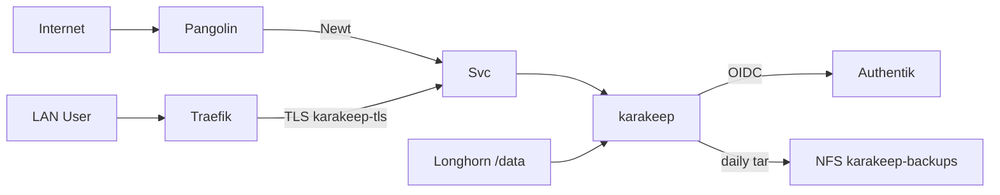

# ADR-0023: Karakeep mit Authentik-OIDC und Pangolin-Ext

- **Status:** Accepted
- **Datum:** 2026-09-27
- **Kontext:** `apps/dev/karakeep/`, Issue [HenryHST/minilab#71](https://github.com/HenryHST/minilab/issues/71)

## Kontext

Homelab braucht einen selbstgehosteten Bookmark-Store mit SSO und optionalem Internetzugang (Browser-Extension). Karakeep (ex Hoarder) bietet native OIDC, SQLite unter `/data`, Meilisearch und Chrome-Crawler.

## Entscheidung

- **Ownership:** ApplicationSet `dev`, Wave 3, plain Git-Pfad `apps/dev/karakeep` ([ADR-0022](0022-apps-bucket-applicationsets.md)).
- **Helm:** Chart `karakeep-app/karakeep` 0.33.1 vendored → committed `helm-manifest.yaml` ([ADR-0014](0014-helm-strategie.md)).
- **Hosts:**
  - LAN `karakeep.stadthagen.dev` → Traefik LB `192.168.0.215` (manueller Hetzner A)
  - Public `karakeep-ext.stadthagen.dev` → Pangolin publish / Newt ([ADR-0011](0011-pangolin-public-exposure.md))
- **Auth:** native OIDC gegen Authentik; Callback `/api/auth/callback/custom` für LAN + Ext; keine ForwardAuth; Pangolin `sso: false`.
- **Secrets:** `KARAKEEP_OAUTH_CLIENT_SECRET`, `KARAKEEP_NEXTAUTH_SECRET`, `KARAKEEP_MEILI_MASTER_KEY` via SecretSpec (nicht in Git). Chart-Secret-Generierung aus.
- **Storage:** Longhorn STS-PVC `data-karakeep-0` (20Gi) + Meili 5Gi.
- **Backup:** CronJob `karakeep-backup-cron` (07:00 UTC) tar’t `/data` → NFS `…/karakeep-backups` (Retention 7). Bootstrap-Restore via ConfigMap `karakeep-restore` — siehe [ADR-0015](0015-backup-restore-cronjobs.md). Meili-Index nach Restore neu.

## Konsequenzen

- Terraform `karakeep_oauth` + SecretSpec müssen denselben Client-Secret teilen; Redirects für beide Hosts.
- `NEXTAUTH_URL` bleibt LAN-kanonisch; Ext-Login über zweite Redirect-URI prüfen.
- `karakeep-ext` gehört in `gitops-owned-resources.txt` / pangolin-publish — nicht in Terraform `dns_records`.
- Kein OpenAI/Ollama in v1 (Tagging optional später).
- Restore nur bewusst mit `enabled=true` (bei vorhandenen Daten `force=true`); danach sofort `enabled=false` committen.
