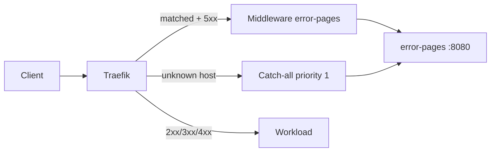

# ADR-0024: Traefik Error-Pages (Maintenance)

- **Status:** Accepted
- **Datum:** 2026-09-27
- **Kontext:** `apps/infra/error-pages/`, Issue [HenryHST/minilab#83](https://github.com/HenryHST/minilab/issues/83); Upstream [tarampampam/error-pages](https://github.com/tarampampam/error-pages)

## Kontext

Bei Backend-Ausfällen und unbekannten Hosts liefert Traefik leere oder plain-text Antworten. Homelab-Nutzer sollen eine klare Maintenance-/Error-Seite mit Link zu Status und Homepage sehen.

## Entscheidung

- **Ownership:** GitOps via ApplicationSet `infra` + native Argo Helm OCI ([ADR-0014](0014-helm-strategie.md)), Namespace `error-pages`, sync wave `1`.
- **Chart:** `error-pages` **4.2.5** (`ghcr.io/tarampampam/error-pages/charts`), Template `app-down`.
- **Middleware-Statuscodes:** nur **`500-504`** (Gateway / Backend down). Kein Rewrite von Authentik-401/403 oder API-4xx.
- **Catch-all:** `IngressRoute` auf Entrypoint `websecure`, `HostRegexp(.+)`, `priority: 1`, `sendSameHttpCode: true`.
- **Traefik-Verdrahtung (Infra_LAB Ansible):** `providers.kubernetesCRD.allowCrossNamespace=true` und Entrypoint-Middleware `error-pages-error-pages@kubernetescrd` auf `websecure`.

## Konsequenzen

- Gestylte Seiten bei 503/502 o. Ä. und für unbekannte Hostnamen.
- Ansible-Traefik-Upgrade erst **nach** erfolgreichem Sync der Argo-App (Middleware-CRD muss existieren).
- Kein Pangolin-Publish; Fehlerseiten nur hinter Cluster-Traefik.
