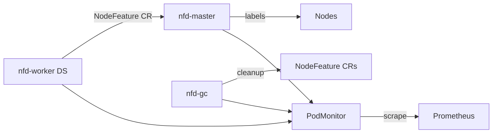

# ADR-0025: Node Feature Discovery (NFD)

- **Status:** Accepted
- **Datum:** 2026-09-27
- **Kontext:** `apps/infra/nfd/`, Issue [HenryHST/minilab#82](https://github.com/HenryHST/minilab/issues/82); Upstream [kubernetes-sigs/node-feature-discovery](https://kubernetes-sigs.github.io/node-feature-discovery/v0.19/deployment/helm.html)

## Kontext

Workloads sollen per Node-Selector/Affinity auf Hardware- und Software-Features schedulen können (CPU-Flags, PCI, Kernel-Module usw.). Ohne NFD fehlen standardisierte Feature-Labels auf den Nodes.

## Entscheidung

- **Ownership:** GitOps via ApplicationSet `infra` + native Argo Helm OCI ([ADR-0014](0014-helm-strategie.md)), Namespace `node-feature-discovery`, sync wave `1`.
- **Chart:** `node-feature-discovery` **0.19.0** (`registry.k8s.io/nfd/charts`), Release-Name `nfd`.
- **Komponenten:** master, worker (DaemonSet), gc — Defaults; topologyUpdater bleibt aus.
- **Metrics:** `prometheus.enable: true` → PodMonitors; Scraping über kube-prometheus-stack (leere PodMonitor-Selektoren).
- **Tolerations:** `worker.tolerations: [{operator: Exists}]`, damit auch control-plane Nodes (k3s NoSchedule) Feature-Labels bekommen.

## Konsequenzen

- Nodes tragen Labels unter `feature.node.kubernetes.io/*` für Scheduling und Observability.
- NFD-Metriken erscheinen in Prometheus ohne zusätzliche Scrape-Configs.
- Kein Ingress/Pangolin — reiner Cluster-Daemon.
- Nur eine NFD-Installation pro Cluster (Chart unterstützt keine parallelen Deployments gut).
