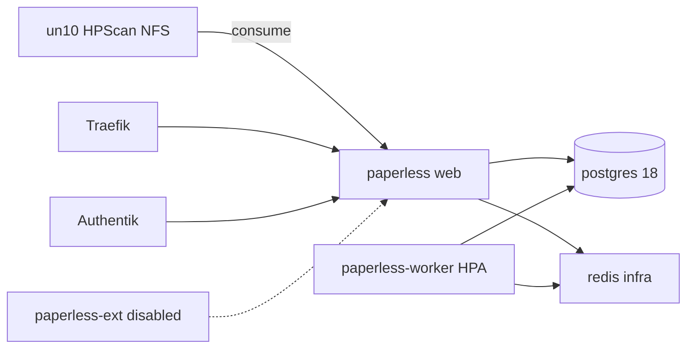

# ADR-0026: Paperless-ngx mit Redis in infra

- **Status:** Accepted
- **Datum:** 2026-09-27
- **Kontext:** `apps/dev/paperless/`, `apps/infra/redis/`, Issue [HenryHST/minilab#64](https://github.com/HenryHST/minilab/issues/64)

## Kontext

Dokumentenarchiv mit OCR, HPScan-Import und Authentik-Login soll auf nXk3 laufen (Fresh-Start, keine pi1cl-Migration). Redis soll wiederverwendbar als eigene Infra-App liegen.

## Entscheidung

- **Ownership:** ApplicationSet `dev` / NS `paperless`, sync wave `3`; Redis ApplicationSet `infra` / NS `redis`, wave `1` ([ADR-0022](0022-apps-bucket-applicationsets.md), [ADR-0014](0014-helm-strategie.md) plain manifests).
- **Stack:** `paperless-ngx:3.0.0`, Postgres `18`, Gotenberg `8.34`, Tika `3.2.2`, Redis `7-alpine`.
- **OCR:** `deu+eng`; Worker-Deployment + HPA 1–3 (podAffinity an Web wegen RWO Longhorn media/data).
- **Consume:** NFS PV von un10 HPScan-Export; Tag `inbox` via PostSync-Job.
- **Auth:** Authentik OIDC (LAN + Ext-Redirects wie Termix); SMTP `mail.henrystadthagen.de:465`.
- **Exposure:** LAN `paperless.stadthagen.dev`; Ext `paperless-ext` in pangolin-publish mit **`enabled: false`** vorbereitet.
- **Backup:** ADR-0015 CronJob (`pg_dump` + data/media tar → NFS).

## Konsequenzen

- Secrets müssen vor Sync gesetzt sein (`PAPERLESS_*` + OAuth pin in Terraform).
- un10 NFS-ACL muss k3s-Nodes erlauben.
- Ext-Traffic erst nach Flip von `enabled: true` in pangolin-publish.
