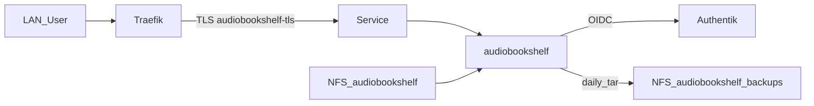

# ADR-0027: Audiobookshelf (LAN, NFS, Authentik OIDC)

- **Status:** Accepted
- **Datum:** 2026-09-29
- **Kontext:** `apps/dev/audiobookshelf/`, Issue [HenryHST/minilab#86](https://github.com/HenryHST/minilab/issues/86)

## Kontext

Hörbücher und Podcasts sollen auf nXk3 laufen (LAN-only), mit SSO über Authentik und persistentem Media-/Config-Storage auf dem bestehenden NFS-Share. Plain Deployment wie Vaultwarden; kein Helm, kein Pangolin-Ext in v1.

## Entscheidung

- **Ownership:** ApplicationSet `dev`, Wave 3, Pfad `apps/dev/audiobookshelf` ([ADR-0022](0022-apps-bucket-applicationsets.md)).
- **Image:** `ghcr.io/advplyr/audiobookshelf` (Version pin), Port 80, Strategy `Recreate`.
- **Host:** `audiobookshelf.stadthagen.dev` → Traefik LB `192.168.0.215` (manueller Hetzner A; kein Terraform `dns_records`, kein pangolin-publish).
- **TLS:** Certificate `audiobookshelf-tls`, Issuer `letsencrypt-prod`.
- **Auth:** Authentik OIDC (slug `audiobookshelf`); OpenID wird in der Abs-UI konfiguriert (Callback `/auth/openid/callback`). Client-Secret via SecretSpec → Secret `audiobookshelf-oauth`. Gruppen `audiobookshelf_admins` / `audiobookshelf_users`.
- **Storage (NFS `192.168.0.25`, nfsvers=3):**
  - `…/audiobookshelf/{audiobooks,podcasts,metadata,config}` → Pod-Mounts
  - `…/audiobookshelf-backups` → Backup-Ziel
- **Backup:** CronJob tar’t nur `/config` (+ Metadata-Index nach ADR-0015); Libraries bleiben auf NFS und werden nicht täglich voll gesichert. Retention 7; Restore via ConfigMap `audiobookshelf-restore`.
- **Homepage:** Link unter Tools in `apps/dev/web` (services.yaml + configmap.yaml).
- **Initial setup:** PostSync Job `audiobookshelf-init` → `POST /init` mit Secret `audiobookshelf-root` (SecretSpec `AUDIOBOOKSHELF_ROOT_PASSWORD`), idempotent bei `isInit=true`. Kein Env-Bootstrap in Image 2.37.0.

## Konsequenzen

- NFS-Verzeichnisse müssen vor dem ersten Sync existieren.
- Terraform `audiobookshelf_oauth_client_secret` und SecretSpec `AUDIOBOOKSHELF_OAUTH_CLIENT_SECRET` müssen identisch sein; `--tags secrets` vor Argo-Sync.
- Abs OpenID einmalig in der UI setzen (kein Env-Override).
- Kein Ext-/Pangolin in v1 — nur LAN-DNS.
