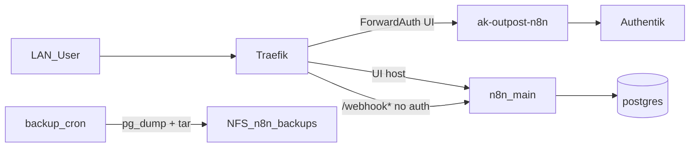

# ADR-0028: n8n (Community, ForwardAuth)

- **Status:** Accepted
- **Datum:** 2026-09-29
- **Kontext:** `apps/dev/n8n/`, Issue [HenryHST/minilab#87](https://github.com/HenryHST/minilab/issues/87)

## Kontext

Workflow-Automatisierung soll auf nXk3 laufen (LAN-only). Native n8n-OIDC (`N8N_SSO_*`) ist Enterprise-only — Community-Edition braucht ein anderes Auth-Modell.

## Entscheidung

- **Ownership:** ApplicationSet `dev`, Wave 3, Pfad `apps/dev/n8n` ([ADR-0022](0022-apps-bucket-applicationsets.md)).
- **Deploy:** [8gears/n8n-helm-chart](https://github.com/8gears/n8n-helm-chart) `2.1.1` / image `2.41.3` → committed `helm-manifest.yaml` ([ADR-0014](0014-helm-strategie.md)); main only (kein Worker/Webhook-Scaler); Chart-Ingress aus; n8n-Daten hostPath auf nxk3-w01 (neben Postgres).
- **Host:** `n8n.stadthagen.dev` → Traefik LB `192.168.0.215` (manueller Hetzner A; kein Terraform `dns_records`, kein pangolin-publish in v1).
- **TLS:** Certificate `n8n-tls`, Issuer `letsencrypt-prod`.
- **Auth:** Traefik ForwardAuth → Outpost `ak-outpost-n8n` (Day-0 Blueprint `day0-n8n`). Gruppen `n8n_admins` / `n8n_users` in Infra_LAB Terraform; PolicyBindings im Blueprint. Nach dem Gate behält Community n8n den lokalen Owner-Login.
- **Webhook-Bypass:** IngressRoute-Routen ohne ForwardAuth für `PathPrefix(/webhook|/webhook-test|/form)`.
- **DB:** Postgres 16 hostPath auf `nxk3-w01` (Termix-Muster); Secrets `n8n-db` / `n8n-app`.
- **Daten:** hostPath `/var/lib/n8n-data` auf `nxk3-w01` (PVC `n8n-data`) — Longhorn-Attach war unzuverlässig; Ownership `1000:1000`.
- **SMTP:** `mail.henrystadthagen.de:465`, `auto@henrystadthagen.de`, Secret `n8n-smtp` ← `AUTHENTIK_EMAIL_PASSWORD`.
- **Backup:** CronJob 03:30 UTC → NFS `…/n8n-backups` (`pg_dump` + tar `.n8n`, Retention 7); Restore via ConfigMap `n8n-restore` ([ADR-0015](0015-backup-restore-cronjobs.md)).
- **Homepage:** Tools-Eintrag in `apps/dev/web`.

## Konsequenzen

- NFS `…/n8n-backups` und Hetzner A müssen vor dem ersten Sync existieren.
- OAuth-App-Slug `n8n` darf nicht parallel in Terraform existieren (Blueprint-Owner).
- Externe Webhooks brauchen die Bypass-Pfade; UI bleibt hinter SSO + lokalem n8n-Login.
