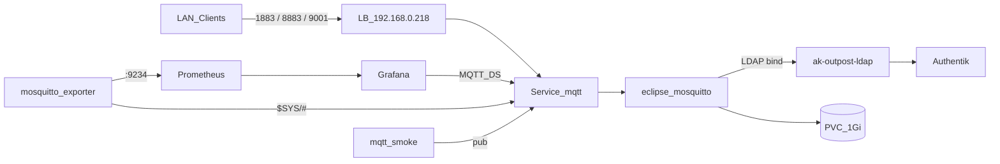

# ADR-0029: Mosquitto (LDAP, LAN LoadBalancer)

- **Status:** Accepted
- **Datum:** 2026-09-30
- **Kontext:** `apps/infra/mosquitto/`, Issue [HenryHST/minilab#90](https://github.com/HenryHST/minilab/issues/90)

## Kontext

Ein MQTT-Broker soll auf nXk3 laufen (LAN). MQTT unterstützt kein OIDC — Auth muss über Benutzer/Passwort (hier Authentik LDAP-Outpost) erfolgen. Cilium-LB-Pool `.215–.218` hat `.218` frei (Traefik/LDAP/Alloy belegt).

## Entscheidung

- **Ownership:** ApplicationSet `infra`, Wave 1, Pfad `apps/infra/mosquitto` ([ADR-0022](0022-apps-bucket-applicationsets.md), [ADR-0003](0003-plain-directory-kein-kustomize.md)).
- **Image:** `ghcr.io/henryhst/mosquitto-custom:1.1.0` (Mosquitto **2.1.2-alpine** + vendored go-auth LDAP-Plugin; [HenryHST/mosquitto-custom](https://github.com/HenryHST/mosquitto-custom)). Conf-Pfad `/mosquitto/config/mosquitto.conf`.
- **Replicas:** 1, Strategy `Recreate` (1 Gi RWO Longhorn; kein Mosquitto-Cluster in v1).
- **Exposure:** Service type LoadBalancer, `loadBalancerIP: 192.168.0.218`, Ports `1883` / `8883` / `9001`.
- **DNS:** Manueller Hetzner A `mqtt-pro` → `192.168.0.218` (kein TF `dns_records`, kein pangolin-publish in v1).
- **TLS:** Certificate `mqtt-pro-stadthagen-dev` / Secret `mqtt-pro-tls`, Issuer `letsencrypt-prod`, dnsName `mqtt-pro.stadthagen.dev`.
- **Auth:** go-auth LDAP (`/mosquitto/go-auth.so`) → `ak-outpost-ldap-stadthagen-outpost.authentik.svc.cluster.local:389`, Base DN `dc=ldap,dc=stadthagen,dc=dev`. Bind als `ldapservice`; User-Filter erfordert Gruppe `mqtt_users` oder `mqtt_admins`. Kein OAuth-Client, kein ForwardAuth.
- **Secrets:** SecretSpec `MOSQUITTO_LDAP_BIND_PASSWORD` (= `ldapservice_password`) → `mosquitto-ldap`; `MOSQUITTO_GRAFANA_PASSWORD` → `grafana-mqtt` (User `mqtt-grafana`); `MOSQUITTO_EXPORTER_PASSWORD` → `mosquitto-exporter` (User `mqtt-exporter` in `mqtt_admins`); `MOSQUITTO_PROBE_PASSWORD` → `mosquitto-probe` (User `mqtt-probe` in `mqtt_users`).
- **$SYS / Metrics:** `sys_interval 10`; Deployment `sapcc/mosquitto-exporter` (amd64-only → `nodeSelector kubernetes.io/arch=amd64`; subscribe `$SYS/#`, `:9234/metrics`) + `ServiceMonitor` (`release: kube-prometheus-stack`); Grafana Dashboard **Mosquitto Broker ($SYS)** (Prometheus `broker_*` metrics). Separate from MQTT-topic Datasource dashboard.
- **Smoke:** Deployment `mqtt-tools` (`eclipse-mosquitto:2`) + CronJob `mqtt-smoke` (alle 15 min).
- **Grafana:** Plugin `grafana-mqtt-datasource`; Datasource in-cluster `tcp://mqtt.mosquitto.svc.cluster.local:1883`; Dashboards ConfigMaps (MQTT topics + Prometheus $SYS).
- **Homepage:** kein Tools-Eintrag in v1 (Broker ohne UI).

## Konsequenzen

- Hetzner A und SecretSpec müssen vor dem ersten produktiven Sync gesetzt sein; Certificate braucht DNS-01 (Hetzner) unabhängig vom A-Record.
- Terraform-Gruppen `mqtt_*` + LDAP-App-PolicyBindings (dev); User ohne Gruppe werden am Broker abgewiesen.
- Exporter braucht `mqtt_admins` (Superuser) für `$SYS/#`; Probe/Grafana bleiben in `mqtt_users`.
- RWO + `replicas: 1` — HA erst mit shared storage / Mosquitto-Bridge später.
