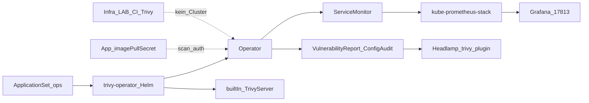

# ADR-0031: Trivy Operator

- **Status:** Accepted
- **Datum:** 2026-10-02 (ergänzt 2026-10-03 Issue #91; 2026-10-07 Headlamp-Plugin)
- **Kontext:** `apps/ops/trivy-operator/`

## Kontext

Image- und Config-Schwachstellen sollen im laufenden Cluster sichtbar sein (CRDs), ergänzend zum CI-Trivy in Infra_LAB (GitHub Actions, CRITICAL/HIGH Gate). Es gibt keinen separaten Security-Bucket; Ops liegt neben cert-manager.

## Entscheidung

- **Ownership:** ApplicationSet `ops`, Wave 1, Namespace `trivy-system` ([ADR-0022](0022-apps-bucket-applicationsets.md), [ADR-0007](0007-sync-waves.md), [ADR-0014](0014-helm-strategie.md)).
- **Chart:** `trivy-operator` **0.32.1** von `https://aquasecurity.github.io/helm-charts/` (App ~0.30.1). Native Argo multi-source + Git `values.yaml`.
- **Scan-Scope:** `targetNamespaces` leer (alle); `excludeNamespaces: kube-system,trivy-system`.
- **Policy:** `trivy.ignoreUnfixed: true` — gleiche Richtung wie Infra_LAB CI (`ignore-unfixed`).
- **Built-in Server:** `operator.builtInTrivyServer: true` — Client/Server-Mode mit Trivy-Server in `trivy-system`.
- **Service:** `service.headless: false` (ClusterIP) für ServiceMonitor-Scrape; `metricsPort` Chart-Default `80`.
- **Metrics:** Chart-`serviceMonitor.enabled` mit Label `release: kube-prometheus-stack` (kein zusätzlicher static scrape job).
- **Grafana:** Dashboard gnetId **17813** (Revision 2, Folder Trivy) in kube-prometheus-stack — [Aqua Tutorial](https://aquasecurity.github.io/trivy-operator/latest/tutorials/grafana-dashboard/).
- **Headlamp:** Plugin Manager installiert [headlamp_trivy 0.3.2](https://artifacthub.io/packages/headlamp/headlamp-trivy/headlamp_trivy) ([kubebeam/trivy-headlamp-plugin](https://github.com/kubebeam/trivy-headlamp-plugin)) in `apps/ops/headlamp` — Views für Vulnerability/ConfigAudit/… CRs.
- **Ressourcen:** Operator memory limit **512Mi** (sonst OOM beim Start vieler Controller).
- **k8tz:** Namespace `trivy-system` in `ignoredNamespaces` — sonst doppelte `k8tz`-InitContainer an Scan-Jobs.
- **Private Registry:** Primär Workload-`imagePullSecrets` (Aqua Option 2; Operator erbt sie). Keine Credentials in Git. Fallback: Secret out-of-band + `operator.privateRegistryScanSecretsNames` (siehe `secret.example.yaml`).
- **Docs:** BookStack-Buch `trivy-operator` v1.1.0; Archify `trivy-architektur`.

## Konsequenzen

- AppProject `ops` muss Destination `trivy-system` erlauben; CRDs sind cluster-scoped (Whitelist `*`).
- Built-in Server erhöht Ressourcen in `trivy-system` (StatefulSet); Speichernutzung und API-Last der Reports beobachten.
- Deinstall: Application entfernen; CRDs nur bewusst löschen (löscht alle Reports).
- CI-Trivy bleibt die Merge-Gate; Operator ist laufende Transparenz, kein Blocker im Git-Flow.
