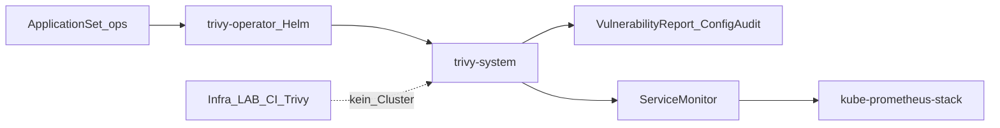

# ADR-0031: Trivy Operator

- **Status:** Accepted
- **Datum:** 2026-10-02
- **Kontext:** `apps/ops/trivy-operator/`

## Kontext

Image- und Config-Schwachstellen sollen im laufenden Cluster sichtbar sein (CRDs), ergänzend zum CI-Trivy in Infra_LAB (GitHub Actions, CRITICAL/HIGH Gate). Es gibt keinen separaten Security-Bucket; Ops liegt neben cert-manager.

## Entscheidung

- **Ownership:** ApplicationSet `ops`, Wave 1, Namespace `trivy-system` ([ADR-0022](0022-apps-bucket-applicationsets.md), [ADR-0007](0007-sync-waves.md), [ADR-0014](0014-helm-strategie.md)).
- **Chart:** `trivy-operator` **0.32.1** von `https://aquasecurity.github.io/helm-charts/` (App ~0.30.1). Native Argo multi-source + Git `values.yaml`.
- **Scan-Scope:** `targetNamespaces` leer (alle); `excludeNamespaces: kube-system,trivy-system`.
- **Policy:** `trivy.ignoreUnfixed: true` — gleiche Richtung wie Infra_LAB CI (`ignore-unfixed`).
- **Metrics:** Chart-`serviceMonitor.enabled` mit Label `release: kube-prometheus-stack`.
- **Secrets / private Registry:** in v1 keines; öffentliche Image-Pulls. Private Registry später (imagePullSecret / Operator-Addon).
- **Docs:** BookStack-Buch `trivy-operator` v1.0.0; Archify `trivy-architektur`.

## Konsequenzen

- AppProject `ops` muss Destination `trivy-system` erlauben; CRDs sind cluster-scoped (Whitelist `*`).
- Reports wachsen mit Workloads; Speichernutzung und API-Last beobachten.
- Deinstall: Application entfernen; CRDs nur bewusst löschen (löscht alle Reports).
- CI-Trivy bleibt die Merge-Gate; Operator ist laufende Transparenz, kein Blocker im Git-Flow.
