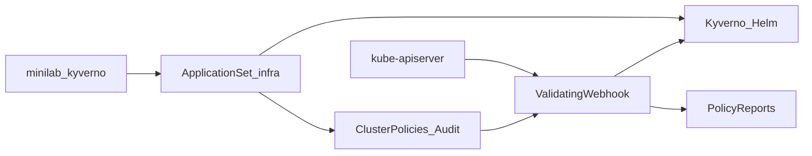

# ADR-0032: Kyverno Admission (Audit)

- **Status:** Accepted
- **Datum:** 2026-10-06
- **Kontext:** `apps/infra/kyverno/`

## Kontext

nXk3 braucht Guardrails für StorageClass, Privileged, Resources, Image-Registries und Longhorn-Placement (Proxmox-Worker), ohne Argo-Syncs zu blockieren. Trivy Operator (ADR-0031) scannt Images; Kyverno prüft Manifest-Politik vor/bei Apply.

## Entscheidung

- **Ownership:** ApplicationSet `infra`, Sync-Wave **0**, Namespace `kyverno` ([ADR-0022](0022-apps-bucket-applicationsets.md), [ADR-0007](0007-sync-waves.md), [ADR-0014](0014-helm-strategie.md)).
- **Chart:** `kyverno` **3.9.1** (app ~v1.19.1) von `https://kyverno.github.io/kyverno/`. Native Argo multi-source + Git `values.yaml` + Extra-Source `policies/`.
- **Mode:** alle ClusterPolicies `validationFailureAction: Audit` + `background: true` wo sinnvoll. **Kein Enforce** in v1.
- **Policies:** `require-longhorn-storageclass`, `require-non-root-or-no-privileged`, `require-requests-limits`, `prefer-proxmox-workers-for-longhorn-pods`, `restrict-image-registries`.
- **Opt-out:** Label `policy.stadthagen.dev/exempt: "true"` auf Namespace oder Objekt; feste Namespace-Excludes für Plattform.
- **Docs:** BookStack-Buch `kyverno`; Archify `kyverno-admission`, `kyverno-gitops`.

## Konsequenzen

- AppProject `infra` Destination `kyverno`; ClusterPolicies sind cluster-scoped (Whitelist `*`).
- Audit erzeugt PolicyReports — Speichernutzung und Noise beobachten, dann gezielt Enforce.
- Ergänzt Trivy (Findings) und RBAC (Wer); ersetzt weder Cilium NetworkPolicy noch PSA.
- Deinstall: Application entfernen; CRDs/Reports nur bewusst löschen.

## Follow-up

- Nach stabilen Reports einzelne Policies auf `Enforce` heben.
- Harbor-Hostname in Image-Allowlist nachziehen, sobald produktiv.
