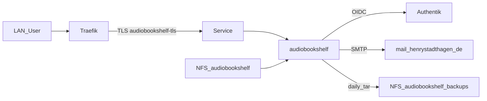

# Übersicht

Audiobookshelf hostet Hörbücher und Podcasts auf nXk3 (LAN-only) mit Authentik-OIDC und NFS-Storage.

| | |
|--|--|
| Argo App | `audiobookshelf` (ApplicationSet `dev`, Wave 3) |
| Namespace | `audiobookshelf` |
| LAN | https://audiobookshelf.stadthagen.dev |
| Ext | — (v1 LAN-only) |
| DNS | Hetzner A `audiobookshelf` → `192.168.0.215` |
| Auth | Authentik OIDC (PostSync Job Wave 6) |
| E-Mail | BookStack-SMTP `mail.henrystadthagen.de:465` (PostSync Job Wave 7) |

ADR: [0027-audiobookshelf](../../../adr/0027-audiobookshelf.md).
