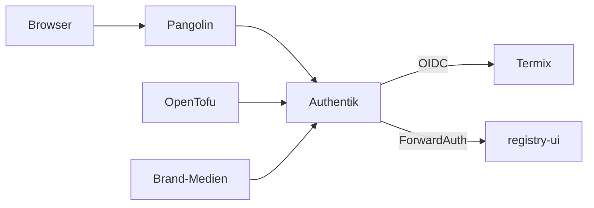

# Übersicht

Authentik ist das zentrale IdP auf nXk3. Öffentlicher Einstieg ist `https://idp.stadthagen.dev` über Pangolin. Apps melden sich per OIDC an oder lassen Traefik per ForwardAuth prüfen.

Explorer: [authentik-architektur.html](https://github.com/HenryHST/minilab/blob/main/docs/diagrams/archify/authentik-architektur.html)

Die feste Viewer-Oberfläche bleibt Englisch. Der Diagramminhalt ist Deutsch.

| | |
|--|--|
| Argo App | `authentik` (ApplicationSet `ops`, Wave 2) |
| Namespace | `authentik` |
| Host | `idp.stadthagen.dev` |
| Chart | authentik `2026.8.3`, gerendert nach `helm-manifest.yaml` |
| Brand | Stadthagen Home |
| Konfiguration | OpenTofu in Infra_LAB `terraform/authentik` |
| Öffentlichkeit | `pangolin-publish`, Ressource `idp` |

ADR: [0010-authentik-idp](../../../adr/0010-authentik-idp.md). Nächste App: Kapitel **Onboarding**. Erscheinungsbild: Kapitel **Brand**. Applications und Gruppen: Kapitel **OpenTofu**. Internet über Pangolin: Kapitel **Externe Ressourcen mit Pangolin**.
