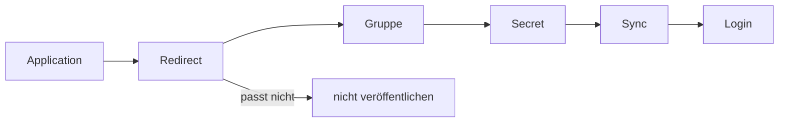

# Onboarding

Neue Apps bekommen kein eigenes IdP. Sie folgen einer der beiden Spalten. Termix ist die ausgefüllte OIDC-Spalte. registry-ui ist die ausgefüllte ForwardAuth-Spalte.

Explorer: [authentik-oidc-onboarding.html](https://github.com/HenryHST/minilab/blob/main/docs/diagrams/archify/authentik-oidc-onboarding.html)

Die feste Viewer-Oberfläche bleibt Englisch. Der Diagramminhalt ist Deutsch.

## Vorlage

| Platzhalter | Native OIDC, Termix | ForwardAuth, registry-ui |
|--|--|--|
| Host | `termix.stadthagen.dev` | `registry-ui.stadthagen.dev` |
| OpenTofu | `modules/shared/authentik_termix.tf`, Modul `oauth_app` | kein Modul; Provider in Authentik anlegen |
| Slug / Issuer | `termix`, `https://idp.stadthagen.dev/application/o/termix/` | Proxy-Provider, Traefik-Modus |
| Redirect | `https://termix.stadthagen.dev/users/oidc/callback` und `/host/opkssh-callback`, Modus `strict` | keiner in der App; Traefik ruft den Outpost |
| Gruppen | `Termix Admins`, `Termix Users` | Bindung am Proxy-Provider |
| Geheimnis | SecretSpec `TERMIX_OAUTH_CLIENT_SECRET` | keines in der App; der Outpost trägt sein Token |
| App-Manifest | `OIDC_*` in `apps/dev/termix/values.yaml` | `apps/ops/registry-ui/manifests/middleware-authentik.yaml` |
| Outpost | keiner | Service `ak-outpost-registry-ui.authentik.svc:9000` |

Scopes bei Termix: `openid`, `email`, `profile`. Der Gruppen-Claim kommt aus dem Profile-Mapping, nicht aus einem eigenen Scope.

## Schritte, native OIDC

1. **Application.** Modul `oauth_app`: Name, Slug, `meta_launch_url` gleich der App-URL. `allowed_redirect_uris` müssen mit dieser URL beginnen. Der Check `redirect_uri_matches_meta_launch_url` bricht sonst ab.
2. **Redirect.** Strict-Match auf den Callback der App. Termix: `/users/oidc/callback`.
3. **Gruppe.** `authentik_group` und `authentik_policy_binding` an die Application. Dieselbe Gruppe trägt die App als Admin-Claim, bei Termix `OIDC_ADMIN_GROUP=Termix Admins`.
4. **Secret.** Client-Secret nur in der SecretSpec. Ansible `--tags secrets` schreibt es ins Cluster. Nicht ins Git.
5. **Sync.** OpenTofu `--tags authentik-bootstrap`, danach die App in Argo. Issuer ist `https://idp.stadthagen.dev/application/o/<slug>/`.
6. **Login.** Die App zeigt den externen Login und kehrt auf den Redirect zurück. Ein Benutzer in der Admin-Gruppe sieht die Admin-Fläche.

Weicht der Redirect von der öffentlichen URL ab, die Application nicht veröffentlichen.

## Schritte, ForwardAuth

1. **Proxy-Provider** für den Host, Modus Traefik forward auth.
2. **Outpost**, dessen Service `ak-outpost-<name>` im Namespace `authentik` auf Port 9000 hört.
3. **Middleware** in der App: `forwardAuth.address` auf `http://ak-outpost-<name>.authentik.svc.cluster.local:9000/outpost.goauthentik.io/auth/traefik`, `trustForwardHeader: true`, Response-Header `X-authentik-username`, `X-authentik-groups`, `X-authentik-email`, `X-authentik-name`, `X-authentik-uid`.
4. **IngressRoute** der App hängt die Middleware ein.
5. **Login.** Der Browser landet bei Authentik und danach auf dem Host. Ohne fertigen Outpost antwortet die App mit einem Auth-Fehler. Das ist der erwartete Zustand, bis Schritt 2 fertig ist.

## Abgrenzung

BookStack, Grafana, Headlamp und Vaultwarden sind weitere OIDC-Apps. Ihre Redirects und Gruppen stehen in den jeweiligen OpenTofu-Dateien, nicht hier. Dieses Kapitel ist die Vorlage, nicht das Verzeichnis.
