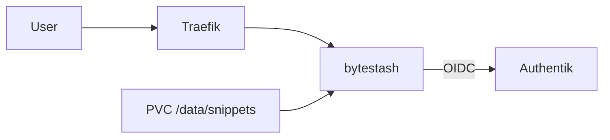

# Übersicht

ByteStash speichert Code-Snippets unter `https://bytestash.stadthagen.dev` (LAN) mit Authentik-OIDC.

| | |
|--|--|
| Argo App | `bytestash` (Wave 3) |
| Namespace | `bytestash` |
| Image | `ghcr.io/jordan-dalby/bytestash:1.5.12` |
| Auth | Authentik OIDC |
| DNS | A `bytestash` → `192.168.0.215` |

ADR: [0021-bytestash](../../../adr/0021-bytestash.md).
