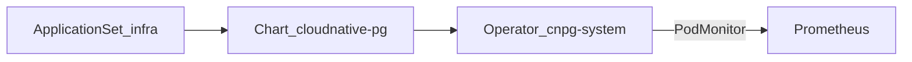

# Übersicht

CloudNativePG stellt den PostgreSQL-Operator auf nXk3 bereit. Installiert ist nur der Operator. Es gibt noch kein `Cluster`-CR und keine Übernahme der bestehenden Postgres-StatefulSets.

| | |
|--|--|
| Argo App | `cloudnative-pg` (ApplicationSet `infra`, Wave 1) |
| Namespace | `cnpg-system` |
| Chart | `cloudnative-pg` 0.27.0 (Operator 1.28.0) |
| ServiceAccount | `postgres-cloud-sa` |
| Metrics | PodMonitor `:8080`, Label `release: kube-prometheus-stack` |

ADR: [0030-cloudnative-pg](../../../adr/0030-cloudnative-pg.md).
