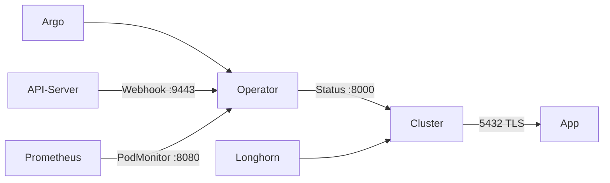

# Übersicht

CloudNativePG betreibt PostgreSQL auf nXk3. Der Operator steht einmalig in `cnpg-system`. Jede Datenbank ist ein `Cluster` im Namespace der App. Der erste Cluster ist Termix (`termix-rw`).

Explorer: [cnpg-architektur.html](https://github.com/HenryHST/minilab/blob/main/docs/diagrams/archify/cnpg-architektur.html)

| | |
|--|--|
| Argo App | `cloudnative-pg` (ApplicationSet `infra`, Wave 1) |
| Namespace | `cnpg-system` nur für den Operator |
| Chart | `cloudnative-pg` 0.27.0, Operator 1.28.0 |
| ServiceAccount | `postgres-cloud-sa` |
| Erster Cluster | `termix` im Namespace `termix` |

ADR: [0030-cloudnative-pg](../../../adr/0030-cloudnative-pg.md). Nächste Datenbank: Kapitel **Onboarding**. Cutover einer bestehenden DB: Buch **Termix**, Kapitel **Migration**.
