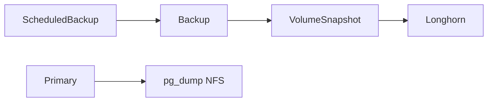

# Architektur

## Operator

- Helm-Release `cloudnative-pg` aus `https://cloudnative-pg.github.io/charts`, Values `apps/infra/cloudnative-pg/values.yaml`.
- `config.clusterWide: true`. Der Operator sieht `Cluster` in jedem Namespace.
- ServiceAccount `postgres-cloud-sa`. ClusterRole und Binding kommen aus dem Chart. Kein zusätzliches User-ClusterRole. `rbac.aggregateClusterRoles` bleibt aus.
- Requests 50m CPU / 128Mi, Limit 256Mi.
- Webhook-Zertifikate bleiben im Chart (`cnpg-webhook-service:443` → Pod `:9443`). cert-manager für `Cluster.spec.certificates` ist nicht eingerichtet.
- Grafana-Dashboard kommt nicht aus Chart 0.27.0. Application `cnpg-grafana` (Chart `cluster` 0.0.5) legt ConfigMap `cnpg-grafana-dashboard` in `monitoring` ab, Label `grafana_dashboard=1`.

## NetworkPolicy

Pod-Selector `app.kubernetes.io/name=cloudnative-pg`.

| Richtung | Port | Wer |
|----------|------|-----|
| Ingress | 9443 | kube-apiserver, beliebige Quelle |
| Ingress | 8080 | nur Namespace `monitoring` |
| Egress | 53 UDP/TCP | DNS |
| Egress | 443, 6443 | Kubernetes-API |
| Egress | 8000 | Instanz-Status der Cluster |

Die zweite Policy `cloudnative-pg-instance-status` erlaubt 8000 noch einmal. Regeln addieren sich. Ohne 8000 bleibt jeder Cluster auf `Instance Status Extraction Error`.

## Cluster

Ein `Cluster` liegt bei der App, nicht unter `apps/infra/cloudnative-pg/`. Der Name bestimmt die Services `<name>-rw`, `<name>-ro`, `<name>-r`. Die App spricht `<name>-rw` auf Port 5432 mit TLS.

Das ServiceAccount des Clusters heißt wie der Cluster. Kollidiert der Name mit einem bestehenden Konto ohne Token, mounten die Instanz-Pods kein API-Token und der Bootstrap bricht ab.

## Metriken

PodMonitor des Operators: Label `release: kube-prometheus-stack`, Port `metrics` (8080).

`monitoring.enablePodMonitor: false` am Cluster. Das Feld ist veraltet und setzt das Release-Label nicht. Jede Datenbank bringt einen eigenen PodMonitor mit (Termix: `apps/dev/termix/podmonitor.yaml`, Port `metrics` 9187). PrometheusRule `cnpg-alerts` in `monitoring` feuert, wenn `cnpg_collector_up` 5 Minuten 0 ist oder der letzte erfolgreiche Backup-Zeitstempel älter als 8 Stunden ist.

## Backup

Volume-Snapshots, kein WAL-Archiv. Ohne Object Store gibt es kein Point-in-Time-Recovery zwischen den Snapshots.

| | |
|--|--|
| Klasse | `VolumeSnapshotClass` `longhorn`, Driver `driver.longhorn.io`, `type: snap` |
| Controller | `snapshot-controller` v8.6.0 in `longhorn-system` (Longhorn-App, Extras) |
| Cluster | `spec.backup.volumeSnapshot.className: longhorn`, online, `snapshotOwnerReference: backup` |
| Plan | `ScheduledBackup`, Cron mit Sekunden, alle 6 Stunden (`0 15 */6 * * *`), `method: volumeSnapshot` |
| Zweite Kopie | `pg_dump` der App, unverändert |

Restore ist ein neuer `Cluster` mit `bootstrap.recovery.volumeSnapshots`, nicht das Einspielen des SQL-Dumps. Der Dump bleibt die Kopie außerhalb des Clusters.

