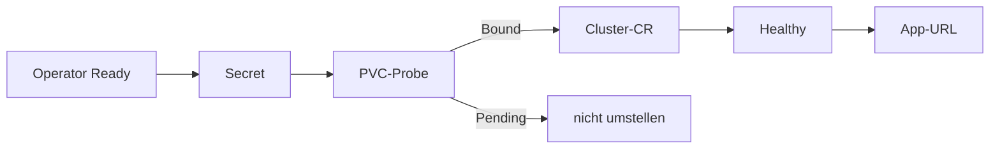

# Onboarding

Der Operator wird einmal installiert. Jede weitere Datenbank wiederholt nur den zweiten Teil. Termix ist die ausgefüllte Spalte. Der Cutover einer schon laufenden Datenbank steht im Buch **Termix**, Kapitel **Migration**.

Explorer: [cnpg-onboarding.html](https://github.com/HenryHST/minilab/blob/main/docs/diagrams/archify/cnpg-onboarding.html)

Die feste Viewer-Oberfläche bleibt Englisch. Der Diagramminhalt ist Deutsch.

## Einmalig: Operator

Diese Schritte sind erledigt. Sie gehören nicht in jede App.

1. Values `apps/infra/cloudnative-pg/values.yaml`: ServiceAccount `postgres-cloud-sa`, `clusterWide: true`, PodMonitor-Label `release: kube-prometheus-stack`, kein Grafana-Dashboard.
2. NetworkPolicies unter `apps/infra/cloudnative-pg/manifests/`. Ingress 9443 offen, Ingress 8080 nur aus `monitoring`, Egress DNS, API 443/6443 und Instanz-Status 8000.
3. ApplicationSet `infra`: `path: apps/infra/cloudnative-pg/manifests`, `namespace: cnpg-system`, `syncWave: "1"`, `helmChart: cloudnative-pg`, `helmVersion: "0.27.0"`, `helmReleaseName: cloudnative-pg`, `extras: true`.
4. AppProject `infra`: Destination-Namespace `cnpg-system`.
5. Sync abwarten und die Checks aus **Deploy und Verify** abhaken.

## Vorlage: nächste Datenbank

| Platzhalter | Termix |
|-------------|--------|
| App-Namespace | `termix` |
| Cluster-Name | `termix` → Services `termix-rw`, `termix-ro`, `termix-r` |
| Instanzen | 1 |
| Image | `ghcr.io/cloudnative-pg/postgresql:16` |
| Volume | 1Gi, StorageClass `longhorn` |
| Secret | `termix-db` mit `username` und `password` |
| App-Schlüssel | `DATABASE_URL` in `termix-ha` |
| Bestehende DB | ja, Import `microservice` von `termix-postgres` |

1. **Operator Ready.** Ohne healthy Operator kein Cluster anlegen.
2. **Secret.** Keys `username` und `password`. Ein abweichender Key der alten Datenbank (`POSTGRES_PASSWORD`) darf daneben stehen, solange die Quelle läuft.
3. **PVC-Probe.** Ein Wegwerf-PVC in Zielgröße und StorageClass. `Pending` heißt Abbruch: Probe löschen, App nicht umstellen.
4. **Cluster-CR** im App-Ordner, Namespace der App. `monitoring.enablePodMonitor: true`. Bei Import: `bootstrap.initdb.import.type: microservice`, Quelle ohne TLS mit `sslmode: disable`. Der Import läuft nur beim ersten Bootstrap.
5. **Healthy.** `kubectl -n <ns> get cluster <name>` zeigt `Cluster in healthy state`. Timeout auf Port 8000 ist die Operator-Policy, kein Datenfehler. Fehlendes ServiceAccount-Token: Namenskollision mit einem Konto ohne Automount.
6. **App-URL.** `postgresql://<user>:<password>@<name>-rw.<ns>.svc.cluster.local:5432/<db>?sslmode=require`. Node-`pg` zusätzlich `uselibpqcompat=true`, sonst scheitert `require` an der Operator-CA. Backup und Restore: `PGHOST=<name>-rw`, `PGSSLMODE=require`.
7. **Prüfen.** App-Logs `postgres database ready`, Login, ein fachlicher Datensatz, ein `pg_dump` gegen `<name>-rw`. hostPath der Quelle erst danach löschen.

Frisch ohne Import: Schritt 4 ohne `externalClusters`, sonst dieselbe Tabelle.
