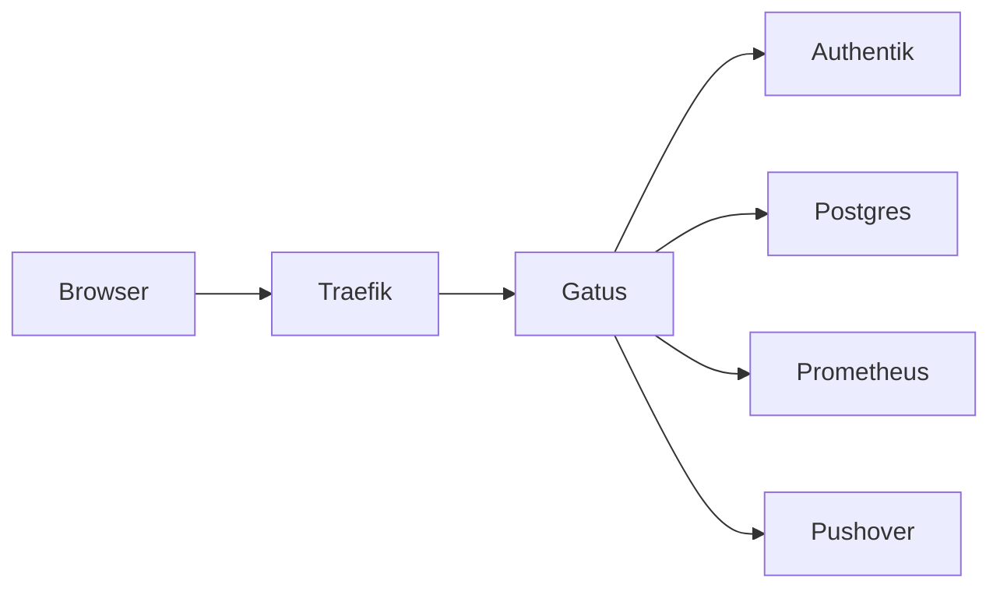

# Übersicht

Gatus ersetzt Uptime Kuma unter `https://status.stadthagen.dev` (nur LAN). Die Historie liegt in CloudNativePG. Login läuft über Authentik-OIDC.

| | |
|--|--|
| Argo App | `gatus` (Wave 3, natives Helm) |
| Chart | `gatus` 1.5.0, App v5.34.0 |
| Namespace | `status` |
| URL | https://status.stadthagen.dev |
| Datenbank | CloudNativePG `gatus-rw`, PostgreSQL 16, 1Gi Longhorn |
| Auth | Authentik-Slug `gatus`, Gruppe `gatus_admins` |
| Alerts | Pushover nach 3 Fehlschlägen |

Diagramm: [gatus-architektur](../../../diagrams/archify/gatus-architektur.html).

ADR: [0034-gatus-cnpg](../../../adr/0034-gatus-cnpg.md).
