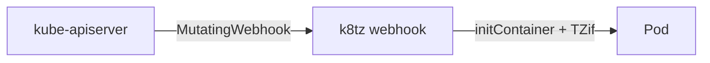

# Übersicht

k8tz ist ein Mutating Admission Webhook, der Pods die Timezone **Europe/Berlin** injiziert (ohne tzdata im Image).

| | |
|--|--|
| Argo App | `k8tz` (ApplicationSet `infra`, Wave 1) |
| Namespace | `k8tz` |
| Chart | `k8tz` 0.20.0 |
| Strategy | `initContainer` |
| Opt-out | `k8tz.io/inject: "false"` |

ADR: [0020-k8tz](../../../adr/0020-k8tz.md).
