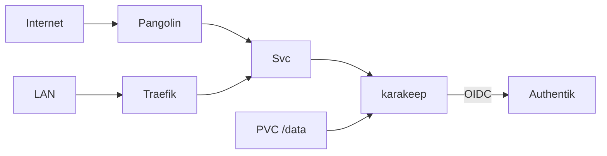

# Übersicht

Karakeep speichert Bookmarks unter `https://karakeep.stadthagen.dev` (LAN) und `https://karakeep-ext.stadthagen.dev` (Internet via Pangolin) mit Authentik-OIDC.

| | |
|--|--|
| Argo App | `karakeep` (Wave 3) |
| Namespace | `karakeep` |
| Chart / Image | karakeep `0.33.1` |
| Auth | Authentik OIDC |
| DNS LAN | A `karakeep` → `192.168.0.215` |
| DNS Ext | A `karakeep-ext` → Pangolin (gitops) |

ADR: [0023-karakeep](../../../adr/0023-karakeep.md).
