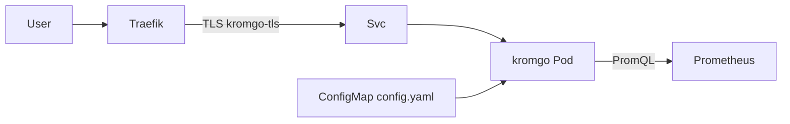

# Übersicht

Kromgo liefert SVG-Badges aus Prometheus-Queries unter `https://kromgo.stadthagen.dev` (nur LAN).

| | |
|--|--|
| Argo App | `kromgo` (Wave 3) |
| Namespace | `kromgo` |
| Image | `ghcr.io/home-operations/kromgo:0.16.1` |
| Auth | TLS only |
| DNS | A `kromgo` → `192.168.0.215` |
| Starter-Badges | `cluster_cpu`, `cluster_memory`, `pod_count` |

ADR: [0019-kromgo](../../../adr/0019-kromgo.md).
