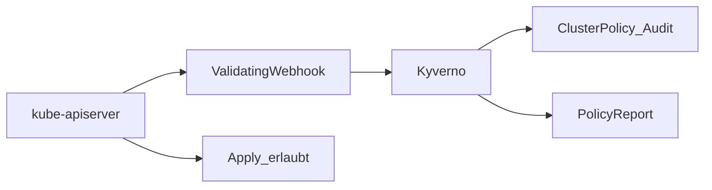

# Übersicht

**Kyverno** ist der Admission-Controller für Manifest-Politik auf nXk3. In v1 laufen alle ClusterPolicies im Modus **Audit**: Verstöße landen in **PolicyReports**, `kubectl apply` und Argo-Sync bleiben erlaubt.

Explorer: [kyverno-admission.html](https://github.com/HenryHST/minilab/blob/main/docs/diagrams/archify/kyverno-admission.html)

| | |
|--|--|
| Argo App | `kyverno` (ApplicationSet `infra`, Wave **0**) |
| Namespace | `kyverno` |
| Chart | kyverno **3.9.1** (~ app v1.19.1) |
| failureAction | `Audit` |
| Opt-out | `policy.stadthagen.dev/exempt: "true"` |

### Abgrenzung

| Mechanismus | Rolle |
|-------------|--------|
| **Kyverno** | *Was* darf ein Manifest (StorageClass, Privileged, Registry, …) |
| **RBAC** | *Wer* darf deployen |
| **Trivy Operator** | Image-/Config-Schwachstellen in laufenden Workloads |
| **Cilium / NetworkPolicy** | Netzwerkpfade (bei uns oft separat / disabled im Bootstrap) |
| **PSA/PSS** | Pod Security Standards — hier nicht clusterweit erzwungen |

ADR: [0032-kyverno-admission-audit](../../../adr/0032-kyverno-admission-audit.md).
