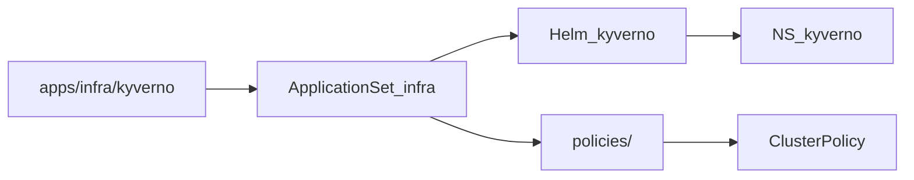

# Architektur

Kyverno kommt per GitOps aus minilab: Helm-Release plus Extra-Source mit ClusterPolicies. Sync-Wave **0**, damit Policies früh existieren, bevor andere infra-Apps (Wave 1) syncen.

Explorer: [kyverno-gitops.html](https://github.com/HenryHST/minilab/blob/main/docs/diagrams/archify/kyverno-gitops.html)

### Komponenten (Chart)

| Controller | Aufgabe |
|------------|---------|
| Admission | Validating/Mutating Webhooks zur Apply-Zeit |
| Background | Periodische Re-Evaluation vorhandener Ressourcen |
| Reports | Schreibt PolicyReport / ClusterPolicyReport |
| Cleanup | Aufräumen (Chart-Default, 1 Replica) |

Values: [`apps/infra/kyverno/values.yaml`](../../../../apps/infra/kyverno/values.yaml) — Homelab mit je 1 Replica. Webhook-Namespace-Selector schließt `kube-system` und `kyverno` aus (zusätzlich zu Policy-Excludes).
