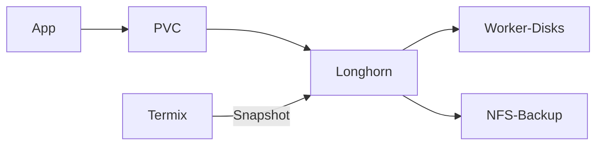

# Übersicht

Longhorn ist die Default-StorageClass auf nXk3. Stateful Apps bekommen damit ein Volume mit drei Replikaten. Die Oberfläche ist `https://longhorn.stadthagen.dev`.

Explorer: [longhorn-architektur.html](https://github.com/HenryHST/minilab/blob/main/docs/diagrams/archify/longhorn-architektur.html)

Die feste Viewer-Oberfläche bleibt Englisch. Der Diagramminhalt ist Deutsch.

| | |
|--|--|
| Argo App | `longhorn` (ApplicationSet `infra`, Wave 1) |
| Namespace | `longhorn-system` |
| Chart | longhorn `v1.12.1` |
| StorageClass | `longhorn`, Default, 3 Replikate |
| UI | `longhorn.stadthagen.dev` |

ADR: [0009-longhorn-nfs-backups](../../../adr/0009-longhorn-nfs-backups.md). Nächstes Volume: Kapitel **Onboarding**. Snapshot und NAS-Backup: Kapitel **Snapshots und Backup**.
