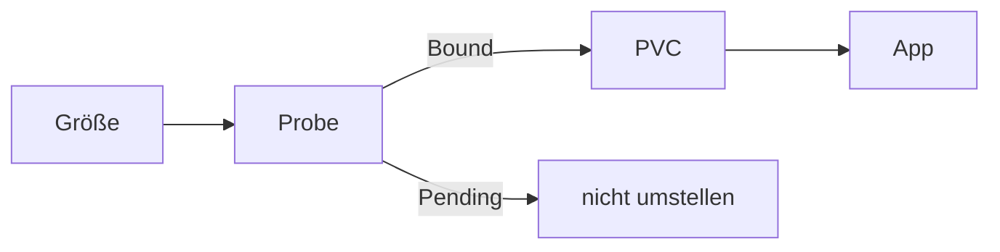

# Onboarding

Jedes neue Volume wiederholt nur diesen Ablauf. Termix ist die ausgefüllte Spalte. Ein Snapshot gehört nur dazu, wenn die App CloudNativePG nutzt.

Explorer: [longhorn-volume-onboarding.html](https://github.com/HenryHST/minilab/blob/main/docs/diagrams/archify/longhorn-volume-onboarding.html)

Die feste Viewer-Oberfläche bleibt Englisch. Der Diagramminhalt ist Deutsch.

## Vorlage

| Platzhalter | Termix |
|--|--|
| Namespace | `termix` |
| PVC | `termix-1`, vom Cluster erzeugt |
| Größe | 1Gi |
| StorageClass | `longhorn` |
| Replikate | 3, aus der Klasse |
| Snapshot | ja, `ScheduledBackup` `termix-snapshot` |
| App-Dump | `termix-backup-cron`, getrennt vom Snapshot |

## Schritte

1. **Größe.** So klein wie der Datenbestand erlaubt. Drei Replikate belegen auf den Worker-Disks etwa das Dreifache. Die Disks sind etwa 32Gi, Over-Provisioning 200 Prozent ist schon angehoben.
2. **Probe.** Ein Wegwerf-PVC in derselben Größe und Klasse `longhorn`. Name eindeutig, nicht der der App.
3. **Bound.** `kubectl get pvc` zeigt `Bound`. Erst dann die App anlegen oder umstellen.
4. **Pending.** Das Probe-PVC löschen und aufhören. Die App nicht auf diese Klasse legen. Ein zweites Volume verschärft den Platzmangel.
5. **App-PVC.** Die App oder der Operator legt das echte Volume an. Bei CloudNativePG steht `storage.storageClass: longhorn` im Cluster-CR.
6. **Snapshot, nur bei CloudNativePG.** `spec.backup.volumeSnapshot.className: longhorn` und ein `ScheduledBackup` mit `method: volumeSnapshot`. Der snapshot-controller muss Ready sein. Details im Kapitel **Snapshots und Backup**.
7. **Prüfen.** PVC `Bound`, Pod Ready, in der UI unter Volume sichtbar. Der App-Dump bleibt ein eigener CronJob.

Frisch ohne Datenbank: Schritt 6 weglassen. Dieselbe Tabelle, ohne Snapshot-Zeile.
