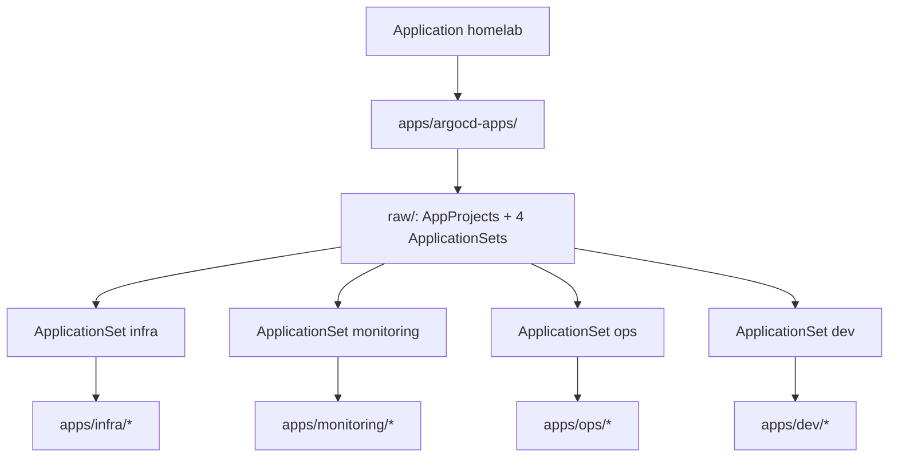

# Sync Waves & GitOps

## Prinzip

Argo CD Parent-App `homelab` synct Bootstrap aus `apps/argocd-apps/` (Application `gitops-bootstrap` + `raw/`). Workloads kommen über **vier ApplicationSets** (`infra`, `monitoring`, `ops`, `dev`) und liegen unter `apps/{infra,monitoring,ops,dev}/`.

**Wichtig:** `targetRevision: main` (nicht `HEAD`).

## Sync Waves (Kurz)

| Wave | Inhalt |
|------|--------|
| -2 | AppProjects (`infra`, `monitoring`, `ops`, `dev`) |
| 0 | Application `gitops-bootstrap` → ApplicationSets; frühe Ops (cert-manager, registry, newt, metrics-server) |
| 1 | longhorn, k8tz, error-pages, kube-prometheus-stack, system-upgrade-controller, cert-manager-webhook, **kubeconfig-user** |
| 2 | authentik, termix, headlamp, hubble-ui, unifipoller |
| 3 | Dev-Tools, Loki/Alloy, vaultwarden, bookstack, pangolin-publish, … |

## kubeconfig-user (Wave 1)

Siehe Kapitel [08-kubeconfig-user.md](08-kubeconfig-user.md): ServiceAccount mit `cluster-admin`, Token-Secret und PostSync-Job → Secret `kubeconfig-user-kubeconfig`. Enable-Flag = ApplicationSet-Listeneintrag; Feintuning über `values.yaml` + Re-Render von `helm-manifest.yaml`.

## Neue App

1. Ordner `apps/<bucket>/<name>/` mit Plain YAML (kein `kustomization.yaml`)
2. Helm: Native Argo-Helm im ApplicationSet **oder** Chart → `helm-manifest.yaml` committen
3. Listeneintrag im passenden `apps/argocd-apps/raw/applicationset-<bucket>.yaml`
4. Push auf `main` → Parent synct automatisch

Siehe ADR-0022 und Root-README.
