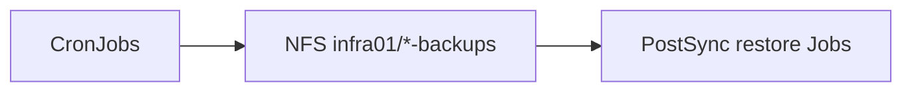

# Backup & Restore

## Schichten

1. **Longhorn**-Volume-Backups → NFS (Cluster-Storage)
2. **App-CronJobs** → NFS `192.168.0.25:/var/nfs/shared/infra01/<app>-backups` (Retention typisch 7)

## Zeitplan (UTC)

| App | Cron | Inhalt |
|-----|------|--------|
| gatus | 01:00 | `pg_dump` |
| vaultwarden | 02:00, 14:00 | `/data` tar (Retention 14; UI `vw-restore`) |
| termix | 03:00 | `pg_dump` |
| bookstack | 04:00 | MariaDB dump + `/config` |
| **authentik** | **05:00** | `pg_dump` + `/media` |
| **bytestash** | **06:00** | tar `/data/snippets` |
| **karakeep** | **07:00** | tar `/data` |

Archify: [App NFS Backup](../../../diagrams/archify/app-nfs-backup.html) · [Bootstrap Restore](../../../diagrams/archify/app-bootstrap-restore.html)

## Bootstrap-Restore

ConfigMap `<app>-restore` → `enabled=true` (bei vorhandenen Daten `force=true`), Argo Sync, danach sofort `enabled=false` committen.

| App | NAS-Ordner | README |
|-----|------------|--------|
| BookStack | `bookstack-backups` | `apps/dev/bookstack/README.md` |
| Authentik | `authentik-backups` | `apps/ops/authentik/README.md` |
| ByteStash | `bytestash-backups` | `apps/dev/bytestash/Readme.md` |
| Karakeep | `karakeep-backups` | `apps/dev/karakeep/Readme.md` |

ADR: 0015, 0009.
