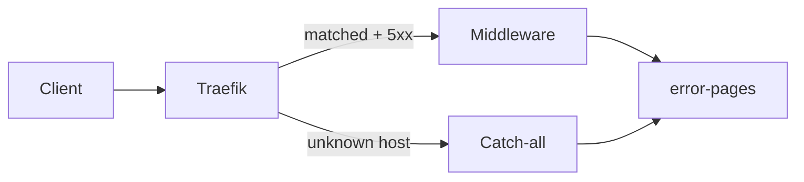

# Error / Maintenance Pages

Clusterweite Fehlerseiten hinter Traefik (`error-pages`).

## Was wird abgefangen?

| Fall | Verhalten |
|------|-----------|
| Backend liefert **500–504** | Traefik Errors-Middleware → Template `app-down` |
| Unbekannter Host (kein Ingress) | Catch-all IngressRoute → 404-Seite |
| Authentik **401/403**, API-4xx | **unverändert** (bewusst kein Rewrite) |

Links auf der Seite: [Status](https://status.stadthagen.dev), [Home](https://web.stadthagen.dev).

## GitOps

- App: `apps/infra/error-pages/` · Namespace `error-pages` · Sync wave 1
- Chart: OCI `error-pages` 4.2.5 (native Argo Helm)
- Extras: Catch-all IngressRoute + NetworkPolicy

## Traefik (Ansible)

Middleware am Entrypoint `websecure` und `allowCrossNamespace` kommen aus Infra_LAB (`henryhst.k3s.traefik`). Reihenfolge: Argo-App syncen → `ansible-playbook site.yaml --tags traefik`.

Details: [ADR-0024](../../../adr/0024-error-pages.md), App-README `apps/infra/error-pages/README.md`.
