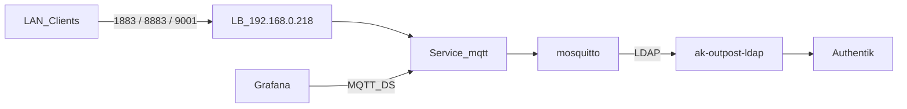

# Übersicht

Eclipse Mosquitto stellt MQTT auf nXk3 bereit. Auth läuft über Authentik LDAP-Outpost (kein OIDC — MQTT unterstützt das nicht). Exposure ist LAN-LoadBalancer `192.168.0.218`.

| | |
|--|--|
| Argo App | `mosquitto` (ApplicationSet `infra`, Wave 1) |
| Namespace | `mosquitto` |
| LAN | `mqtt-pro.stadthagen.dev` → `192.168.0.218` |
| Ports | 1883 MQTT · 8883 MQTTS · 9001 WebSockets (TLS) |
| Auth | LDAP-Gruppen `mqtt_users` / `mqtt_admins` |

ADR: [0029-mosquitto](../../../adr/0029-mosquitto.md).
