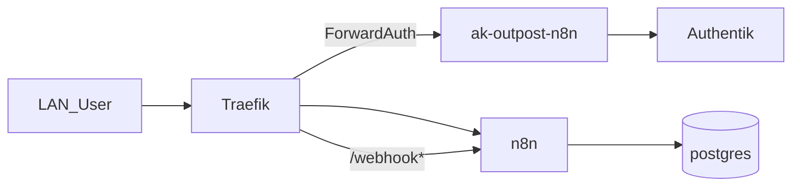

# Übersicht

n8n (Community) automatisiert Workflows auf nXk3. Auth läuft über Traefik ForwardAuth (Authentik Outpost), nicht über natives OIDC.

| | |
|--|--|
| Argo App | `n8n` (ApplicationSet `dev`, Wave 3) |
| Namespace | `n8n` |
| LAN | https://n8n.stadthagen.dev |
| Auth | ForwardAuth + lokaler Owner-Login hinter dem Gate |
| Gruppen | `n8n_admins` / `n8n_users` (wer die UI öffnen darf) |

ADR: [0028-n8n](../../../adr/0028-n8n.md).
