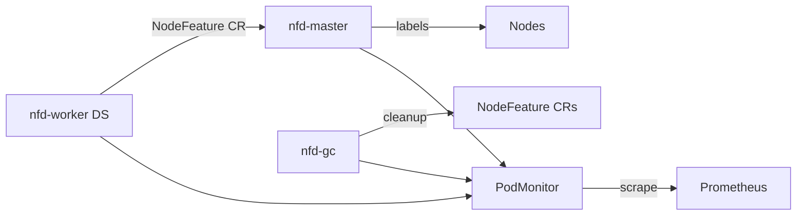

# Übersicht

Node Feature Discovery (NFD) erkennt Hardware- und Software-Features auf jedem Node und veröffentlicht sie als Kubernetes-Labels (`feature.node.kubernetes.io/*`).

| | |
|--|--|
| Argo App | `nfd` (ApplicationSet `infra`, Wave 1) |
| Namespace | `node-feature-discovery` |
| Chart | `node-feature-discovery` 0.19.0 (OCI) |
| Metrics | `prometheus.enable: true` (PodMonitors) |

ADR: [0025-nfd](../../../adr/0025-nfd.md).
