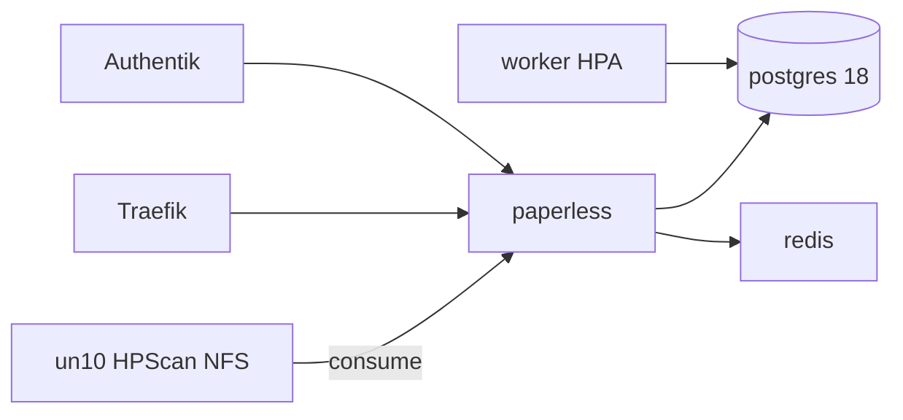

# Übersicht

Paperless-ngx archiviert Dokumente mit OCR (Deutsch + Englisch), importiert Scans vom HPScan-NFS und meldet sich per Authentik an.

| | |
|--|--|
| Argo App | `paperless` (ApplicationSet `dev`, Wave 3) |
| Namespace | `paperless` |
| Redis | `apps/infra/redis` (Wave 1) |
| LAN | https://paperless.stadthagen.dev |
| Ext | https://paperless-ext.stadthagen.dev (**disabled** in pangolin-publish) |

ADR: [0026-paperless-ngx](../../../adr/0026-paperless-ngx.md).
