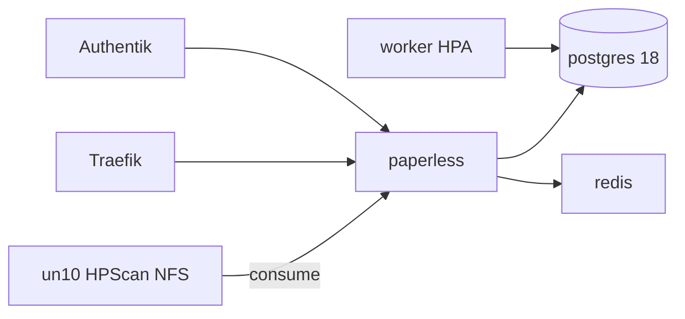

# Übersicht

> **Buch** v1.1.0 · Stand: 2026-10-08

Paperless-ngx archiviert Dokumente mit OCR (Deutsch + Englisch), importiert Scans vom HPScan-NFS und meldet sich per Authentik an.

| | |
|--|--|
| Argo App | `paperless` (ApplicationSet `dev`, Wave 3) |
| Namespace | `paperless` |
| Redis | `apps/infra/redis` (Wave 1) |
| LAN | https://paperless.stadthagen.dev |
| Ext | https://paperless-ext.stadthagen.dev (**disabled** in pangolin-publish) |
| **Storage** | **Postgres:** CNPG `paperless-pg` auf Longhorn. **App-Daten:** lokale Volumes (`local` PVs, StorageClass `manual-paperless`) auf Worker **`nxk3-w01`** — `/var/lib/paperless-data`, `/var/lib/paperless-media`, `/var/lib/paperless-export`. **Consume:** NFS HPScan. **Backups:** NFS `…/infra01/paperless-backups`. |

Web- und Worker-Pods sind an `nxk3-w01` gebunden (Node-Affinity / hostPath). Ohne die drei Verzeichnisse auf dem Node starten sie nicht (`FailedMount`). Details und Anlage: Kapitel **Deploy & Verify** (Local Storage / Troubleshooting). Begründung: [ADR-0026](../../../adr/0026-paperless-ngx.md).
