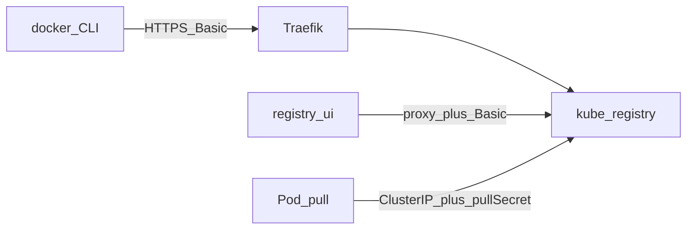

# Übersicht

> **Buch** v1.0.0 · Stand: 2026-10-09

Die Lab-Registry hostet Container-Images für nXk3 (Distribution `registry:3`). Push/Pull laufen über HTTPS; die UI listet denselben Catalog.

| | |
|--|--|
| Argo Apps | `registry`, `registry-ui` (ApplicationSet `infra`, Wave 0) |
| Namespace | `kube-system` (API), `registry-ui` (UI) |
| API | https://registry.stadthagen.dev |
| UI | https://registry-ui.stadthagen.dev |
| Auth API | htpasswd User **`registry`** (Secret `registry-auth`) |
| Auth UI | Authentik ForwardAuth **plus** Registry-Basic (`REGISTRY_SECURED`) |
| Storage | PVC `kube-registry` (Longhorn), GC-CronJob sonntags |

**Wichtig:** Authentik schützt nur die **UI**. Die Registry-API nutzt natives Distribution-htpasswd — kein OIDC/ForwardAuth für `docker login`.

Harbor (`docs/harbor.md`) ist geplant und **nicht** diese Registry. Details Deploy: Kapitel **Deploy & Verify**.
