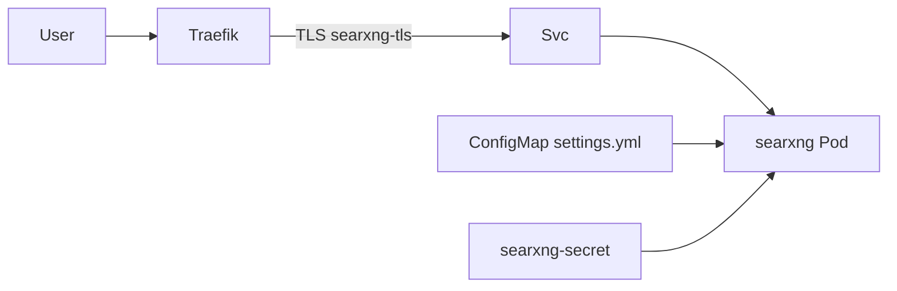

# Übersicht

SearXNG ist die Homelab-Metasuche unter `https://searxng.stadthagen.dev` (nur LAN).

| | |
|--|--|
| Argo App | `searxng` (Wave 3) |
| Namespace | `searxng` |
| Image | `docker.io/searxng/searxng:2026.9.25-12f8b6515` |
| Auth | TLS only (kein Authentik) |
| DNS | A `searxng` → `192.168.0.215` |

ADR: [0018-searxng](../../../adr/0018-searxng.md).
