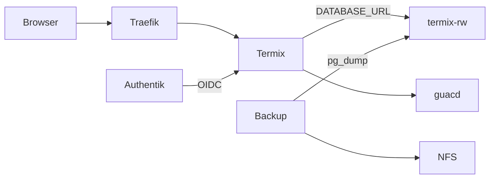

# Übersicht

Termix ist die SSH- und RDP-Konsole auf nXk3. Anmeldung läuft über Authentik-OIDC. Postgres liegt auf CloudNativePG, Service `termix-rw`.

Explorer: [termix-architektur.html](https://github.com/HenryHST/minilab/blob/main/docs/diagrams/archify/termix-architektur.html)

| | |
|--|--|
| Argo App | `termix` (ApplicationSet `dev`, Wave 2) |
| Namespace | `termix` |
| LAN | https://termix.stadthagen.dev |
| Image | `ghcr.io/lukegus/termix:release-2.8.0`, 2 Replicas, Sidecar `guacd` 1.6.0 |
| Auth | OIDC, Gruppe `Termix Admins`, `ALLOW_REGISTRATION=false` |
| Datenbank | Cluster `termix`, 1 Instanz, PG 16, 1Gi Longhorn, Service `termix-rw` |

ADR: [0030-cloudnative-pg](../../../adr/0030-cloudnative-pg.md). Migration: Kapitel **Migration**.
