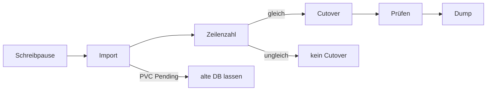

# Migration

Dieses Kapitel ist die Vorlage für die nächste Postgres-Migration auf CloudNativePG. Zuerst die allgemeinen Schritte, danach die Werte und der Ablauf von Termix.


Explorer: [termix-db-migration.html](https://github.com/HenryHST/minilab/blob/main/docs/diagrams/archify/termix-db-migration.html)

Die feste Viewer-Oberfläche bleibt Englisch. Der Diagramminhalt ist Deutsch.



## Vorlage

Vor dem ersten Schritt diese Tabelle füllen. Die rechte Spalte ist Termix.

| Platzhalter | Termix |
|-------------|--------|
| App / Namespace | `termix` / `termix` |
| Replicas während der Pause | 2 → 0 → 2 |
| Cluster-Name | `termix` → Service `termix-rw` |
| Image | `ghcr.io/cloudnative-pg/postgresql:16` |
| Volume | 1Gi, StorageClass `longhorn` |
| Quelle | StatefulSet `termix-postgres`, Service `termix-postgres`, hostPath `/var/lib/termix-postgres` auf `nxk3-w01` |
| DB / User | `termix` / `termix` |
| Quell-TLS | keins, Import `sslmode: disable` |
| Secret | `termix-db`: `POSTGRES_PASSWORD` bleibt, zusätzlich `username` und `password` |
| App-URL | Secret `termix-ha`, Key `DATABASE_URL` |
| Backup | `PGHOST`, `PGSSLMODE` in Backup- und Restore-Manifest |

### 1. Speicher prüfen

Ein Wegwerf-PVC mit der Zielgröße und derselben StorageClass anlegen. Bleibt er `Pending`, abbrechen. Die alte Datenbank nicht anfassen, das Wegwerf-PVC löschen.

Bei Termix band Longhorn 1Gi trotz DiskPressure auf drei Nodes. Der Probe-PVC wurde danach gelöscht.

### 2. Secret für den Import

CloudNativePG liest am Cluster die Keys `username` und `password`. Die alte Datenbank kann einen anderen Key nutzen (`POSTGRES_PASSWORD`). Beide behalten, solange die Quelle noch läuft. Danach `--tags secrets`.

### 3. Cluster neben der Quelle

Manifest im App-Ordner, Quelle bleibt im Git. Import einmalig:

- `bootstrap.initdb.import.type: microservice`
- `externalClusters` auf den bestehenden Service
- `sslmode: disable`, wenn die Quelle kein TLS spricht
- `monitoring.enablePodMonitor: true`

Der Import läuft nur beim ersten Bootstrap. Ein zweiter Versuch braucht ein neues Volume.

### 4. Schreibpause

```bash
kubectl -n <ns> scale deploy/<app> --replicas=0
```

Die Quelle (StatefulSet) bleibt Ready. Sonst kann der Import keine Verbindung aufbauen.

### 5. Import und Abbruch

Cluster anwenden und auf `Cluster in healthy state` warten.

- PVC bleibt `Pending`: Cluster und PVC löschen, alte DB unverändert lassen.
- Status `Instance Status Extraction Error` und Timeout auf Port 8000: Operator-Egress TCP 8000 fehlt. Policy ergänzen, nicht die Datenbank zurückrollen.
- Fehlendes ServiceAccount-Token (`/var/run/secrets/kubernetes.io/serviceaccount/token`): der Cluster heißt wie ein vorhandenes ServiceAccount mit `automountServiceAccountToken: false`. Token für dieses Konto erlauben und App-Pods explizit auf `false` setzen. Danach den hängenden Import-Job samt PVC löschen und den Cluster neu anlegen.

### 6. Zeilenzahl

Dieselbe Abfrage auf Quelle und Ziel, nur Schema `public`, nur echte Tabellen (`relkind = r`). Abweichung: kein Cutover. Quelle behalten.

### 7. Cutover

Erst wenn die Zähler gleich sind:

1. `DATABASE_URL` auf `<cluster>-rw` mit `sslmode=require`. Für Node-`pg` zusätzlich `uselibpqcompat=true`.
2. Backup und Restore: `PGHOST=<cluster>-rw`, `PGSSLMODE=require`.
3. Altes Service und StatefulSet aus Git entfernen.
4. App auf die bisherige Replica-Zahl skalieren.
5. Login und einen fachlichen Datensatz prüfen.
6. Einmal `pg_dump` gegen den neuen Service. hostPath erst danach löschen.

Argo stellt gelöschte Objekte wieder her, solange `main` das alte Manifest noch enthält. Der Cutover der App (URL) bleibt gültig. Das alte StatefulSet verschwindet dauerhaft erst mit dem Merge.

### 8. Nicht anfassen, bis der Dump liegt

hostPath, NFS-Backups und das Quell-Secret `POSTGRES_PASSWORD`. Der Dump ist die Freigabe, die Dateien auf dem Node zu löschen. Die alten SQL-Archive bleiben.

## Termix-Lauf

1. Secret `termix-db` um `username=termix` und `password` ergänzt. `POSTGRES_PASSWORD` blieb.
2. `apps/dev/termix/cnpg-cluster.yaml` angelegt, `postgres.yaml` zunächst gelassen.
3. Deployment `termix` auf 0 skaliert. StatefulSet `termix-postgres` lief weiter.
4. Cluster `termix` importierte per `microservice` von `termix-postgres` (`sslmode: disable`).
5. 82 Tabellen, Zeilenzahlen identisch. Belegt waren nur `users` 1, `roles` 2, `settings` 4, `user_roles` 1, `user_workspaces` 1, `ui_preferences` 1, `host_sidebar_preferences` 1. Host-Tabellen waren schon vorher leer.
6. `DATABASE_URL` auf `termix-rw` mit `sslmode=require&uselibpqcompat=true`. Backup und Restore auf `PGHOST=termix-rw`, `PGSSLMODE=require`.
7. App wieder auf 2 Replicas. Logs: `postgres database ready`. Login-Seite lädt. OIDC-User ist Admin, ein gespeicherter Host war nicht vorhanden.
8. Job `termix-backup-cutover` schrieb `/backup/termix-20260930-191312.sql.gz` (19,8K) von `termix-rw`.
9. hostPath `/var/lib/termix-postgres` auf `nxk3-w01` ist nicht gelöscht.
10. **Hybrid-TLS (2026-10-07):** Server-CA/TLS über cert-manager (`cnpg-certificates.yaml` → Secret `termix-server-tls`). Client/Replication bleiben Operator-managed. App weiter `sslmode=require&uselibpqcompat=true` (kein CA-Mount).

### Störungen bei Termix

| Symptom | Ursache | Änderung für die nächste App |
|---------|---------|------------------------------|
| Import-Pod ohne API-Token | ServiceAccount der App heißt wie der Cluster und mountet kein Token | Vorher prüfen. App-Pods opt-out, Konto mit Token |
| `SELF_SIGNED_CERT_IN_CHAIN` | Node-`pg` prüft bei `sslmode=require` die Operator-CA | `uselibpqcompat=true` oder CA mounten |
| Cluster nicht healthy, Timeout `:8000` | Operator-NetworkPolicy ohne Egress 8000 | Egress von Anfang an |
| StatefulSet kommt zurück | Argo synct `main`, der Branch ist noch nicht dort | Manifeste mergen, bevor das alte StatefulSet wegbleiben soll |
