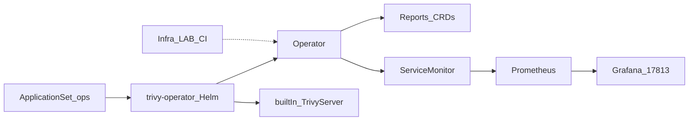

# Übersicht

Der **Trivy Operator** scannt laufende Workloads im nXk3-Cluster und schreibt Findings als Kubernetes-CRDs (`VulnerabilityReport`, `ConfigAuditReport`, …). Das ergänzt das CI-Trivy in Infra_LAB (GitHub Actions als Merge-Gate) — der Operator ist Transparenz im Cluster, kein Git-Blocker.

Ab v1.1.0: built-in Trivy-Server, ClusterIP-Service für Metrics, Grafana-Dashboard 17813.

Explorer: [trivy-architektur.html](https://github.com/HenryHST/minilab/blob/main/docs/diagrams/archify/trivy-architektur.html)

